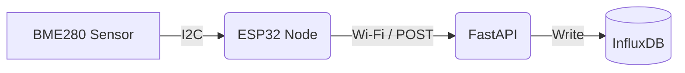

# TYTO (Telemetry Yielding Thermal Observations)

    

## Project Overview
TYTO is a home weather station project. This central repository hosts the API built with FastAPI and the InfluxDB database used to store environmental data. In the future, this API will serve historical data for a graphical interface.

### Architecture



* **FastAPI**: Provides the HTTP endpoints to receive sensor data.
* **InfluxDB**: Time-series database storing temperature, humidity, and pressure measurements.
* **Docker**: The entire application stack is containerized using Docker Compose for easy deployment.

## Prerequisites

* A Raspberry Pi (or any host machine) connected to your local network with a static IP address.
* Docker and Docker Compose installed on the host.

## Installation & Setup

### 1. Database Setup

First, you need to start the database container to configure it and generate an access token:

```bash
docker compose up -d influxdb
```

1. Open your web browser and navigate to `http://<YOUR_PI_IP>:8086`.
2. Follow the setup wizard to create your initial user, **Organization**, and **Bucket**.
3. Once logged in, the interface will give you a token, keep it safe it won't show up again.

### 2. API Configuration

Create a `config.py` file in the root directory with your InfluxDB credentials:

```python
INFLUXDB_URL = "http://influxdb:8086"
INFLUXDB_TOKEN = "your_generated_token"
INFLUXDB_ORG = "your_organization"
INFLUXDB_BUCKET = "your_bucket_name"
```

### 3. Start the API

Build and start the complete stack:

```bash
docker compose up -d --build
```

## API Endpoints

* `POST /api/measurements`: Receives JSON payloads containing `temperature`, `humidity`, and `pressure` data from the sensor nodes.

## Next Step: Sensor Node

To complete the installation and start collecting data, you need to set up the hardware sensor. Head over to the [TYTO ESP32 Repository](https://github.com/TytoAlbaGuttata/tyto-esp) for the physical node setup and firmware instructions.

## Contributing

This is a completed personal project. Contributions, issues, and feature requests are not accepted. However, you are completely free to fork the repository and modify it for your own personal use.

## License

This project is licensed under the MIT License - see the [LICENSE](LICENSE) file for details.

